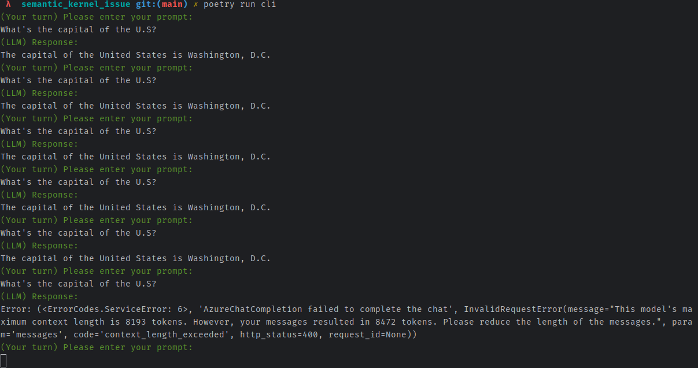

# semantic kernel issue

Reproduce issue reported in https://github.com/microsoft/semantic-kernel/issues/3559

## Install dependencies

```shell
poetry run install
```

## Reproduce

Launch the cli

```shell
poetry run cli
```

Ask repeatedly the model, see screenshot:

